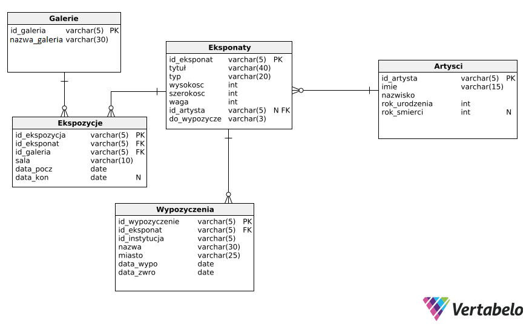

## English

# Museum Exhibit Management System (Student Project)

## Project Description
This project is designed to help an art museum manage its exhibits (paintings, sculptures, etc.) using a PostgreSQL database and a simple web application.  
It allows storing information about artworks, their creators, galleries, and loans to other institutions.

## Entity-Relationship Diagram


## Features
- Store information about:
  - Exhibits (unique code, title, type, dimensions, and weight)
  - Artists (ID, first name, last name, year of birth, year of death)
  - Museum galleries
  - Exhibit location history and loans
- Web application (HTML/PHP) allows:
  - Adding new exhibits, artists, and galleries
  - Updating exhibit locations
  - Recording and viewing loans
  - Searching for works by a specific artist and checking their availability for visitors
- Database diagram showing tables and relationships

## Business Rules Implemented
- No exhibit can be outside the museum for more than 30 days per year
- The museum always has at least one exhibit from each artist in its galleries or storage
- History of exhibitions and loans is stored, not just current locations

## Getting Started
> The database and web application were created on a student server. To run them locally:

1. Install [PostgreSQL](https://www.postgresql.org/) on your computer
2. Create a new database and import `Muzeum.sql` (creates tables and triggers)
3. Update the database connection settings in the PHP files:
   ```php
   $link = pg_connect("host=localhost dbname=your_database user=your_user password=your_password");
4. Open the HTML page in your browser, or run a local server so the pages can connect to the database

## Polski

# System obsługi eksponatów muzealnych (projekt studencki)

## Opis projektu
Projekt miał na celu wspomaganie muzeum sztuki w zarządzaniu eksponatami (obrazami, rzeźbami itp.) poprzez komputerową bazę danych i prostą aplikację internetową.  
Umożliwia przechowywanie informacji o dziełach sztuki, ich twórcach, galeriach oraz wypożyczeniach do innych instytucji.

## Co zrobiłem
- Stworzyłem bazę danych w PostgreSQL, zawierającą informacje o:
  - eksponatach (unikalny kod, tytuł, typ, wymiary i wagę),  
  - artystach (ID, imię, nazwisko, rok urodzenia i rok śmierci),  
  - galeriach muzeum,  
  - historii położenia eksponatów i wypożyczeń.  
- Zaimplementowałem prostą stronę internetową (HTML/PHP), która umożliwia:
  - wprowadzanie nowych eksponatów, artystów i galerii,  
  - aktualizację położenia eksponatów,  
  - wprowadzanie i przeglądanie wypożyczeń,  
  - wyszukiwanie dzieł danego artysty oraz informacji o dostępności dla zwiedzających.  
- Przygotowałem diagram bazy danych pokazujący tabele i połączenia między nimi.  

## Zasady, które zostały uwzględnione
- Żaden eksponat nie może przebywać poza muzeum dłużej niż 30 dni rocznie.  
- Muzeum zawsze posiada przynajmniej jeden eksponat każdego artysty w swoich galeriach lub magazynie.  
- Historia ekspozycji i wypożyczeń jest przechowywana, nie tylko aktualne położenie eksponatów.  

## Jak uruchomić projekt lokalnie
Baza danych jak i strona z aplikacją była wykonana w ramach serwera studenckiego, więc uruchomienie ich w obecnej formie jest niemożliwe. Aby uruchomić je lokalnie:
1. Zainstaluj PostgreSQL na swoim komputerze.  
2. Utwórz nową bazę danych i zaimportuj plik `Muzeum.sql` (tworzy tabele i wyzwalacze).  
3. W plikach PHP zmień dane połączenia z bazy danych na lokalne:
   ```php
   $link = pg_connect("host=localhost dbname=twoja_baza user=twoj_user password=twoje_haslo");
4. Otwórz stronę HTML w przeglądarce lub uruchom lokalny serwer, aby strona mogła połączyć się z bazą danych.
